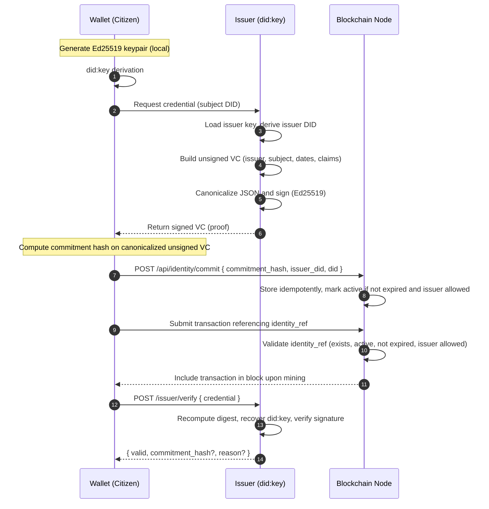

# Identity flow (Mermaid)

---

- Issuer public key export: `/issuer/jwk` (kid is deterministically derived from pubkey)
- Commitment log: append-only `commitments.log` → Merkle root via `compute_root`
